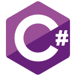
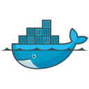

 
	<h2><b>W e l c o m e</b></h2>
	<h3>to my profile</h3>

	👋 Hello! I'm Riccardo 'ace' H. I am a self-taught programmer and designer from Germany currently living in Switzerland.

 

 
	I mostly focus on backend, functional or object-oriented programming. But from time to time I also do some frontend. My first priority in coding is that I never have to repeat myself, nor do things multiple times. I rather spend a little more time minimizing or automating those tasks than doing them by hand every time.

 

 
	I currently work as a software and application engineer with a focus on optimizing department workflows. My goal is to automate and eliminate unnecessary steps while maintaining consistent standards to reduce integration time.

	<h3>My current <b>Stack</b>:</h3>
	<h4><b>Languages & Frameworks:</b></h4>
	 &nbsp;&nbsp;
	 &nbsp;&nbsp;
	 &nbsp;&nbsp;
	 &nbsp;&nbsp;
	 &nbsp;&nbsp;
	 &nbsp;&nbsp;
	 &nbsp;&nbsp;
	 &nbsp;&nbsp;
	 &nbsp;&nbsp;
	 &nbsp;&nbsp;
	 &nbsp;&nbsp;
	 &nbsp;&nbsp;
	 
	 
	<h4><b>Tools & Services:</b></h4>
	 &nbsp;&nbsp;
	 &nbsp;&nbsp;
	 &nbsp;&nbsp;
	 &nbsp;&nbsp;
	 
	 
	<h4><b>Operating Systems:</b></h4>
	 
	<h4>
		
		 
		
<b>Main PC:</b> Windows 11

		
<b>Work PC:</b> Windows 10

	</h4>
	<h4>
		
		 
		
<b>Webserver & Gameserver:</b> Debian 11

		
<b>Home Server (VM):</b> Debian 11

	</h4>

